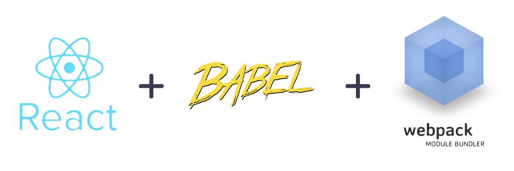

# React Webpack Boilerplate
> A minimalistic boilerplate to begin an new React project

[![NPM Version][npm-image]][npm-url]
[![Downloads Stats][npm-downloads]][npm-url]



## Development setup

clone the project and run the following commands to get started

```sh
npm install
npm run build
```

## Release History

* 0.1.0
    * The first release
    * CHANGE: added dev server
* 0.0.1
    * initial commit

## Meta

Craig Wheeler – craig@craigwheeler.net
[https://github.com/craigwheeler/react-webpack-boilerplate](https://github.com/craigwheeler/react-webpack-boilerplate)

## Contributing

1. Fork it (<https://github.com/yourname/yourproject/fork>)
2. Create your feature branch (`git checkout -b feature/fooBar`)
3. Commit your changes (`git commit -am 'Add some fooBar'`)
4. Push to the branch (`git push origin feature/fooBar`)
5. Create a new Pull Request

<!-- Markdown link & img dfn's -->
[npm-image]: https://img.shields.io/npm/v/datadog-metrics.svg?style=flat-square
[npm-url]: https://npmjs.org/package/datadog-metrics
[npm-downloads]: https://img.shields.io/npm/dm/datadog-metrics.svg?style=flat-square
[travis-image]: https://img.shields.io/travis/dbader/node-datadog-metrics/master.svg?style=flat-square
[travis-url]: https://travis-ci.org/dbader/node-datadog-metrics
[wiki]: https://github.com/yourname/yourproject/wiki
